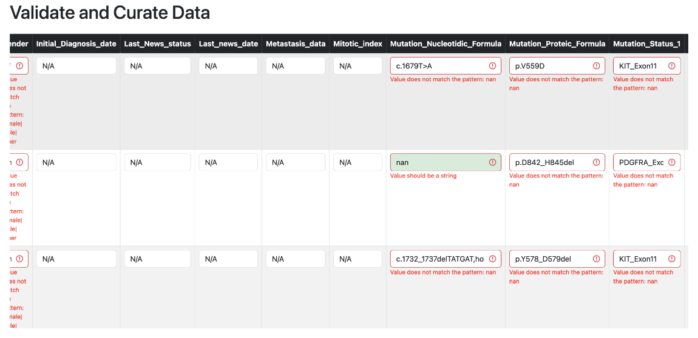

# GraDaCu - **Gra**mmar-based **Da**ta **Cu**ration

Map, curate and validate your tabular data using grammar rules. 

## Installation

### Docker

You can run the application using Docker. First, build the Docker image using the following command:

`docker build -t gradacu .`

Then, run the Docker container using the following command:

`docker run -p 5000:5000 gradacu`

Now you can open your browser and go to `http://localhost:5000/` to use the application.

### Manually

Create a Python environment and install the dependencies using the following commands:

`pip install -r requirements.txt`

To run the code, use the following command:

`python app.py`

Now you can open your browser and go to `http://localhost:5000/` to use the application.
Adjust the Host and Port in the `app.py` file if needed.

# Usage

Here you can upload your data file and the grammar file.

### Grammar File

The grammar file should contain the following columns:

| Column Name      | Explanation                                                                                                                                                                         | Example Values                                                           |
|------------------|-------------------------------------------------------------------------------------------------------------------------------------------------------------------------------------|--------------------------------------------------------------------------|
| `col.name`       | Contains the column name which your data should have                                                                                                                                | `Name`, `ID`, `Date`, `Type`                                             |
| `col.class`      | Contains the data type of the column: character (use regex rule), date (use python date format string)                                                                              | `character`, `date`                                                      |
| `uniqueness`     | Specifies whether the column should have unique values or not                                                                                                                       | `unique`, `non-unique`                                                   |
| `requiredness`   | Specifies whether the column is required or optional                                                                                                                                | `required`, `optional`                                                   |
| `multiplevalues` | Specifies whether the column can have multiple values in the following notation instead of regex rules: `value1\|value2\|value3`                                                    | `TRUE`, `FALSE`                                                          |
| `allowedvalues`  | Specifies the allowed values for the column. Can be regex pattern in case of character class, multiple values if it is set to true or python date format in case of the date class. | `(?:[a-z]\|[A-Z])[a-zA-Z]+)`, `%m/%Y`, `categoryA\|categoryB\|categoryC` |

#### An example grammar .csv file:

| col.name | col.class | uniqueness | requiredness | multiplevalues | allowedvalues                   |
|----------|-----------|------------|--------------|----------------|---------------------------------|
| Name     | character | non-unique | required     | FALSE          | (?:[a-z]      \|[A-Z])[a-zA-Z]+ |
| ID       | character | unique     | required     | FALSE          | (?:[a-z]      \|[A-Z])[a-zA-Z]+ |
| Date     | date      | non-unique | optional     | FALSE          | %m/%Y                           |
| Type     | character | non-unique | optional     | TRUE           | categoryA\|categoryB\|categoryC |

Your data can be in CSV / XLSX format. It should contain the columns specified in the grammar. The application will validate the data based on the grammar rules.

### Column Mapping

You first see a screen which enables you to map columns from your source data file to the grammar columns. It tries to automatically map the columns based on the column names if possible. You can manually adjust the mappings if needed.

### Data Validation / Curation

After mapping the columns, the data is validated based on the grammar rules. The application will show you the errors in the data based on the grammar rules. You can re-validate the data after making changes. If all errors are resolved you can download the curated data.